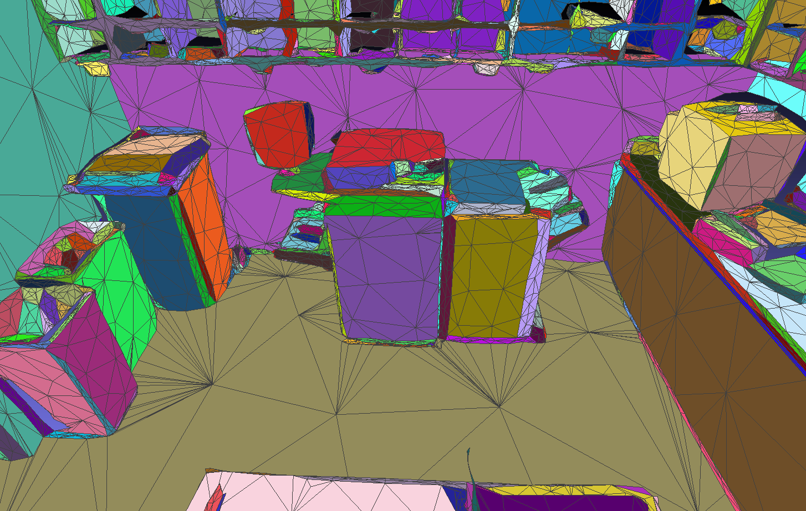
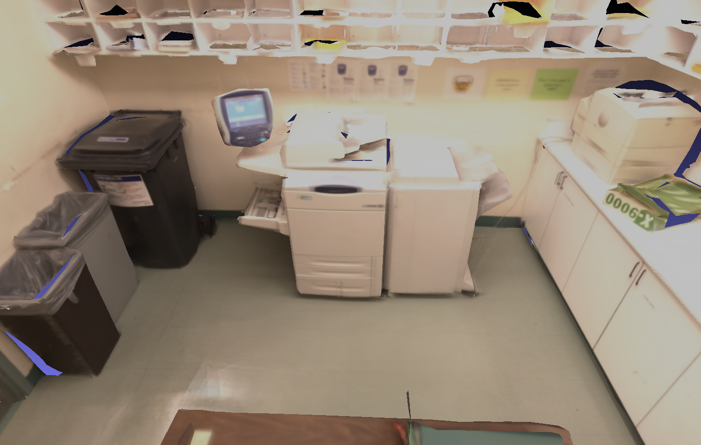

# PlaneRecon
Plane-Based RGB-D reconstruction of indoor scenes with geometry and texture optimization.

An example of plane partition result of scan *copyroom* from [BundleFusion dataset](http://graphics.stanford.edu/projects/bundlefusion/):



Textured mesh:



## Related publications
Please cite these two papers if you want to use the code and data:
```
@inproceedings{wang2018plane,
  title={[Plane-Based Optimization of Geometry and Texture for RGB-D Reconstruction of Indoor Scenes]},
  author={Wang, Chao and Guo, Xiaohu},
  booktitle={2018 International Conference on 3D Vision (3DV)},
  pages={533--541},
  year={2018},
  organization={IEEE}
}
```
([here is PDF](http://www.utdallas.edu/~xxg061000/3DV2018.pdf))
and
```
@InProceedings{Wang_2019_CVPR_Workshops,
author = {Wang, Chao and Guo, Xiaohu},
title = {Efficient Plane-Based Optimization of Geometry and Texture for Indoor RGB-D Reconstruction},
booktitle = {The IEEE Conference on Computer Vision and Pattern Recognition (CVPR) Workshops},
month = {June},
year = {2019}
}
```
([here is PDF](http://openaccess.thecvf.com/content_CVPRW_2019/papers/SUMO/Wang_Efficient_Plane-Based_Optimization_of_Geometry_and_Texture_for_Indoor_RGB-D_CVPRW_2019_paper.pdf))


## Usage

PlaneRecon pipeline contains 4 programs running in time order:
- `mesh_partition`: takes as input a dense mesh, partition and then simplify it based on planes, and output simplified mesh with partition.
- `mesh_visibility`: takes as input one mesh and camera poses in some RGB-D frames, compute the visible mesh vertices in each frame;
- `blur_estimation`: estimate image blurriness for color images from a RGB-D sequence;
- `mesh_texture_opt`: takes as input: 1) RGB-D sequence, including color and depth images and camera poses; 2) the simplified mesh from `mesh_partition`; 3) visibility data across frames from `mesh_visibility`; 4) blurriness of color images from `blur_estimation`. Output: final textured obj mesh with optimized geometry and texture.

You can use the script `run_linux.sh` to run the entire pipeline. Note to modify relevant input parameters.

Each code has its own ReadMe file about usage and compilation. Refer to them for more details.

## Dependencies

Dependencies for all programs are:
- Eigen (matrix computation)
- OpenCV 2 or 3 (image processing and I/O);
- gflags (global flags and debug);
- GLEW (OpenGL support, only needed in `mesh_visibility` code)
- GLFW (window and interface, only needed in `mesh_visibility` code)
- GLM (OpenGL math, code already included, only needed in `mesh_visibility` code)

## Build

In linux, simply run `build_linux.sh` and it will build all 4 programs.

Will support Windows build soon.

## Data

A typical input data for this code can be found from [BundleFusion](http://graphics.stanford.edu/projects/bundlefusion/) or [3DLite](http://graphics.stanford.edu/projects/3dlite/) data, which contains reconstructed PLY model and camera pose files for each RGB-D sequence.

This code also supports ICL-NUIM dataset, but the sequence format is slightly different. You need to change it to fit the BundleFusion data format. Refer to `run_linux.sh` for more details. Also, if you want to create a dense mesh from ICL-NUIM data or other RGB-D sequence, you can try [VoxelHashing](https://github.com/niessner/VoxelHashing).


## Result
The folder `models` contains result textured meshes used in the paper.

## Note
- Currently this code is a CPU-only. Actually OpenMP or GPU computation can be introduced to many time-consuming processes in the code. Will try to accelerate the code soon.
- It's not hard to combine these programs into one program. Actually, this can also save some data I/O time. We use separate programs just for better debugging and easier reusing.
- `mesh_partition` program needs large amount of memory. For instance, for a mesh with 1M faces, it takes about 20G memory.

## Other relevant code
#### Plane detection on RGB-D frames

Source code can be found here: https://github.com/chaowang15/RGBDPlaneDetection
