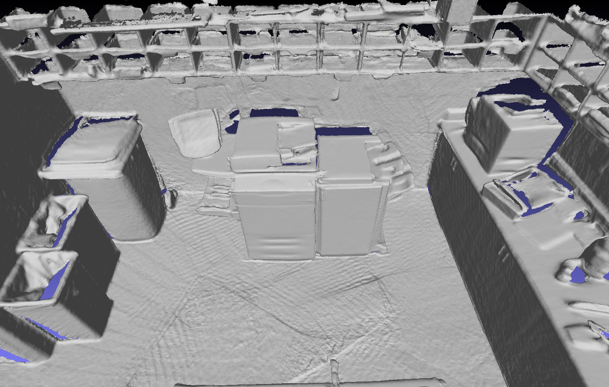
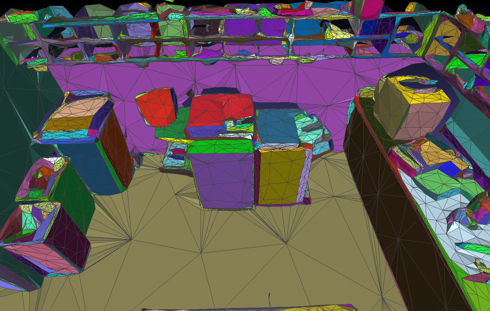

# mesh_partition
Given a dense PLY mesh as input, `mesh_partition` can partition the mesh into planes and then simplify it based on planes to get a low-polygon PLY mesh.

A dense mesh of scan *copyroom* (3.7M vertices, 7.3M faces) from BundleFusion dataset:



Output simplified mesh with plane partition (1.6K vertices, 3.1K faces, each color denotes one plane):



## Dependencies
- Eigen 3 (matrix computation)
- [gflags](https://github.com/gflags/gflags) (global flags and debug);

## Usage
```
1) mesh_partition input_ply target_cluster_number [output_ply output_cluster_file]

2) mesh_partition input_ply input_cluster_file [output_ply output_cluster_file]
```
Here the second command is taking a cluster file as input. It is used to skip the time-consuming partition step and only run the subsequent steps. Our suggestion is to run the program with the first command and get an initial cluster file, then run the program again with the second command by taking the cluster file you just got as input, just like:
```
# Run the program with first command with target plane/cluster number 2000
mesh_partition input.ply 2000 output_ini.ply output_ini.txt
# Run it again with second command
mesh_partition output_ini.ply output_ini.txt output.ply output.txt
```

## Build
In linux:
```
mkdir build && cd build
cmake ..
make
```
## Note
- For some large model, this program needs a large amount of memory. For instance, for a mesh with 1M faces, it takes about 20G memory.
- The `swapping` step in the mesh partition pipeline is optional and it takes the **majority time** of the entire pipeline. This step is to swap possible cluster/plane border faces to their neighbor faces for a fixed number of loops, which is used to further decrease the global plane energy and make cluster border smoother. Skipping this step may get a slightly worse plane distribution but not much, since we still merge neighbor planes after this swapping step anyway. You can skip the swapping step by setting the gflag `--swapping_loop_num=0`.
